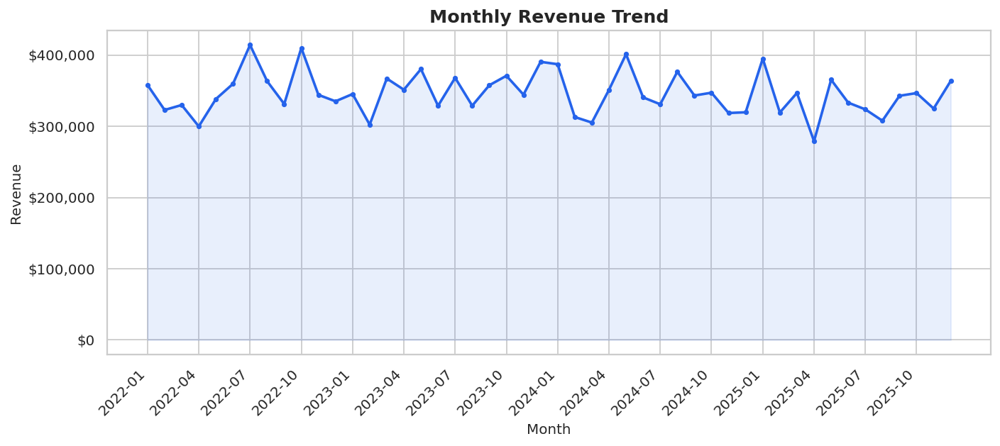
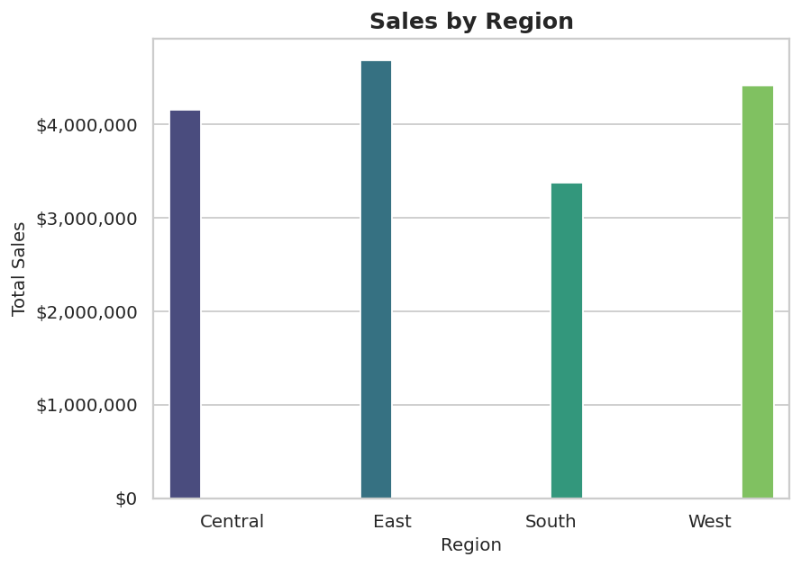
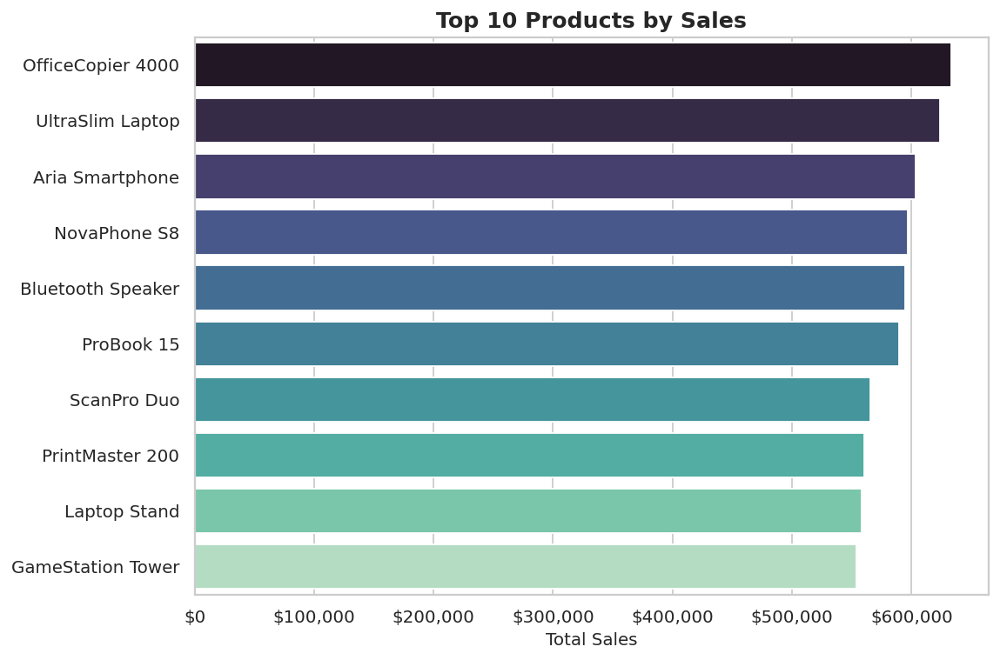
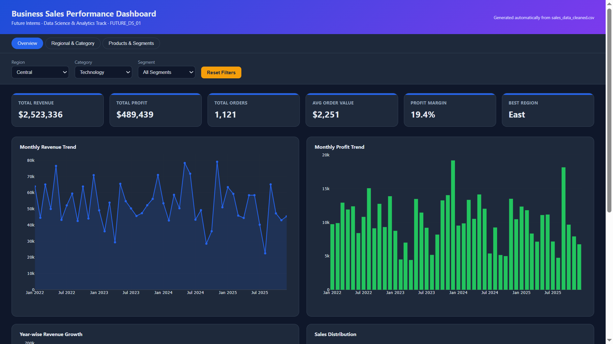

# 📊 Business Sales Performance Analytics

[](https://www.python.org/)
[](https://pandas.pydata.org/)
[](https://plotly.com/)
[](https://jupyter.org/)
[](LICENSE)
[]()

> **Future Interns — Data Science & Analytics Internship**
> **Project Code:** `FUTURE_DS_01` &nbsp;|&nbsp; **Task 1:** Business Sales Performance Analytics

A complete, end-to-end analytics project that transforms raw multi-year sales transaction data into a client-ready dashboard, PDF report, and set of actionable business recommendations.

---

## 🎯 Project Overview

This project analyzes 12,000+ sales transactions to answer core business performance questions:

- What are our **revenue and profit trends** over time?
- Which **products, categories, and regions** drive the most value?
- Where is **profit being lost**, and why?
- What **actions** should the business take next?

The deliverable is designed to look and function like a real client engagement: a cleaned dataset, a fully documented analysis notebook, a reusable Python analytics package, an interactive dashboard, and a polished PDF report.

---

## ✨ Features

- 🧹 **Robust data cleaning pipeline** — missing values, duplicates, type conversion, outlier treatment (IQR-based winsorization)
- 🛠️ **Feature engineering** — Year/Month/Quarter, Shipping Days, Profit Margin %, Average Order Value
- 📈 **16 professional visualizations** covering trends, category/region breakdowns, distributions, correlations, and growth
- 🧮 **Automated business KPI engine** (revenue, profit, AOV, margin, best/worst region & category, growth %, etc.)
- 🖥️ **Interactive Plotly-powered HTML dashboard** with live filters (Region / Category / Segment) and a navigation bar
- 📄 **Client-ready 15+ page PDF report** with executive summary, methodology, KPIs, charts, insights, and recommendations
- 📓 **Fully documented Jupyter notebook** walking through the entire analysis end-to-end
- ♻️ **Modular, reusable, PEP8-compliant Python source code** (`src/`)

---

## 🛠️ Tech Stack

### Programming Language
- Python 3.12+

### Data Analysis
- Pandas
- NumPy

### Data Visualization
- Matplotlib
- Seaborn
- Plotly

### Report Generation
- ReportLab

### Development Environment
- Jupyter Notebook
- VS Code

### Version Control
- Git
- GitHub

### Deployment
- GitHub Pages

### Documentation
- Markdown (README)

## 🗂️ Folder Structure

```
FUTURE_DS_01/
│
├── data/
│   └── sales_data.csv               # Raw synthetic dataset (12,000+ rows)
│
├── notebook/
│   └── Business_Sales_Analytics.ipynb   # Full end-to-end analysis notebook
│
├── src/
│   ├── data_cleaning.py             # Cleaning & feature engineering pipeline
│   ├── analysis.py                  # KPI & business summary calculations
│   ├── visualization.py             # Chart generation (Matplotlib/Seaborn)
│   ├── dashboard.py                 # Interactive Plotly HTML dashboard builder
│   └── generate_report.py           # Client-ready PDF report builder
│
├── index.html         # Interactive Dashboard (GitHub Pages)
│
├── reports/
│   └── Business_Sales_Report.pdf    # Client-ready PDF report
│
├── images/
│   ├── revenue_trend.png
│   ├── sales_by_region.png
│   ├── sales_by_category.png
│   ├── top_products.png
│   ├── dashboard_preview.png
│   └── ... (16 charts total)
│
├── README.md
├── requirements.txt
├── LICENSE
└── .gitignore
```

---

## 📂 Dataset

This project uses a **synthetic business sales dataset** containing **12,120 sales transactions** created for data analysis and visualization purposes.

### Dataset Overview
- **Total Records:** 12,120
- **Total Features:** 21
- **Data Type:** Synthetic Business Sales Data
- **Format:** CSV
- **File:** `data/sales_data.csv`

### Key Features
- Order ID
- Order Date
- Ship Date
- Customer ID & Customer Name
- Segment
- Country
- State & City
- Region
- Category & Sub-Category
- Product Name
- Sales
- Quantity
- Discount
- Profit
- Shipping Mode
- Payment Method
- Sales Representative

### Project Usage
The dataset is used for:

- Data Cleaning & Preprocessing
- Exploratory Data Analysis (EDA)
- KPI Generation
- Business Insights
- Interactive Dashboard Development
- Data Visualization
- PDF Report Generation

A cleaned version of the dataset (`sales_data_cleaned.csv`) is also generated during preprocessing for further analysis.

## ⚙️ Installation

```bash
# 1. Clone the repository
git clone https://github.com/singhmadhusudan2003-wq/FUTURE_DS_01.git
cd FUTURE_DS_01

# 2. (Recommended) create a virtual environment
python -m venv venv
source venv/bin/activate      # Windows: venv\Scripts\activate

# 3. Install dependencies
pip install -r requirements.txt

```

## 📦 Requirements

- Python 3.12+
- pandas, numpy
- matplotlib, seaborn, plotly
- reportlab (PDF report generation)
- jupyter / notebook / ipykernel

All pinned in [`requirements.txt`](requirements.txt).

---


## 🌐 Live Demo

🔗 **Interactive Dashboard**

https://singhmadhusudan2003-wq.github.io/FUTURE_DS_01/

## 🖥️ Dashboard Preview

The interactive dashboard provides business KPIs, revenue and profit trends, regional performance, category-wise analysis, and dynamic filters for data exploration.


### 📈 Monthly Revenue Trend



### 🌍 Sales by Region



### 🏆 Top Products



### 🖥️ Interactive Dashboard




## ▶️ How to Run

**Option 1 — Explore the full analysis in Jupyter:**
```bash
jupyter notebook notebook/Business_Sales_Analytics.ipynb
```

**Option 2 — Regenerate everything from the command line:**
```bash
cd src

# 1. Clean the data + engineer features
python data_cleaning.py

# 2. Generate all 16 charts into ../images
python visualization.py

# 3. Build the interactive dashboard
python dashboard.py

# 4. Build the PDF report
python generate_report.py
```

**Option 3 — Just view the outputs directly:**
- Open `index.html` in any modern web browser to explore the interactive dashboard.
- Open [`reports/Business_Sales_Report.pdf`](reports/Business_Sales_Report.pdf) for the full client report.

---

## 💡 Business Insights

- **Technology drives the business** — the top revenue and profit category, powered by a handful of high-ticket products.
- **Discounts above ~20% erode profitability** — the clearest, most controllable lever for improving margin.
- **Regional imbalance exists** — the South region consistently trails East, West, and Central.
- **Revenue is right-skewed (Pareto pattern)** — a small number of large orders drive a disproportionate share of total sales.
- **Office Supplies is a volume category, not a value category** — highest units sold, lowest revenue contribution.
- **Shipping speed is not currently a profit driver**, based on correlation analysis.

See the [full report](reports/Business_Sales_Report.pdf) for all 10 consolidated insights and 15 actionable recommendations.

---

## 🚀 Future Scope

- Incorporate marketing spend/CAC data to compute true ROI by channel and region
- Build a cohort-based Customer Lifetime Value (CLV) model
- Add a forecasting layer (Prophet/ARIMA) for proactive revenue and risk-month prediction
- Automate the dashboard and report to refresh on a scheduled basis as new data arrives

---

## 📜 License

This project is licensed under the [MIT License](LICENSE).


## 👤 Author

**Madhu Sudhan**

- 🎓 B.Tech in Artificial Intelligence & Data Science
- 💼 Data Science & Analytics Intern at Future Interns
- 💻 Passionate about Data Science, Machine Learning, AI, and Data Analytics

### Connect with Me

- **GitHub:** https://github.com/singhmadhusudan2003-wq
- **LinkedIn:** https://www.linkedin.com/in/madhu-sudhan-a241073b9/

---


## ⭐ Support

If you found this project useful, please consider giving it a ⭐ on GitHub.

<p align="center"><i>Built as part of the Future Interns Data Science & Analytics Internship — FUTURE_DS_01</i></p>
